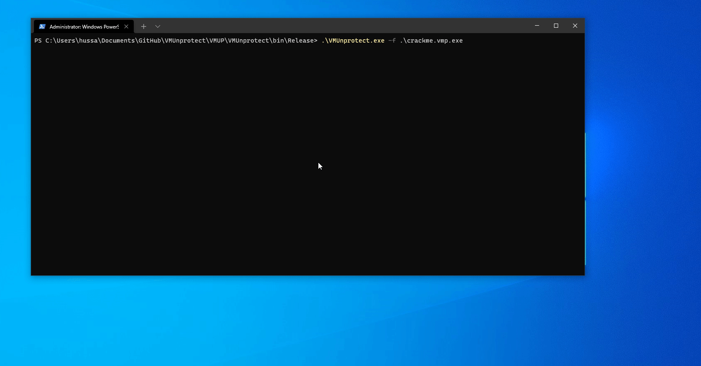

<p align="center">
  
<h1 align="center">VMUnprotect.NET</h1>
<p align="center">
  <strong>VMUnprotect</strong> is a project engaged in hunting virtualized <a href="https://vmpsoft.com">VMProtect</a> methods. It makes use of <a href="https://github.com/pardeike/Harmony">Harmony</a> to dynamically read <strong>VMP</strong> behavior. Currently only supports method administration. Works on <a href="https://vmpsoft.com/20210919/vmprotect-3-5-1/">VMProtect 3.5.1</a> (Latest) and few versions back.
</p>
</p>
<p align="center">
  
  
</p>
</p>

## Showcase


# Usage
```sh
VMUnprotect.exe 
  -f, --file         Required. Path to file.
  --usetranspiler    (Default: false) Use an older method that makes use of Transpiler (not recommended).
  --help             Display this help screen.
  --version          Display version information.
```

# Supported Protections
Note: ***All Supported Protections are working combined***

Protection Name | Is supported | 
------------- | :----: 
Memory Protection | Yes 
Import Protection | Yes 
Resource Protection | Yes 
Debugger Detection | Yes 
Virtualization Tools | Yes 
Strip Debug Information | Yes 
Pack the Output File | No

# Usage can be found in ```Methods\MiddleMan.cs```
```csharp
 internal static class MiddleMan
    {
        public static void Prefix(ref object __instance, ref object obj, ref object[] parameters, ref object[] arguments)
        {
            var virtualizedMethodName = new StackTrace().GetFrame(7).GetMethod();
            var method = (MethodBase) __instance;

            ConsoleLogger.Warn("\tVMP MethodName: {0} (MDToken {1:X4})", virtualizedMethodName.FullDescription(), virtualizedMethodName.MetadataToken.ToString());
            ConsoleLogger.Warn("\tMethodName: {0}", method.Name);
            ConsoleLogger.Warn("\tFullDescription: {0}", method.FullDescription());
            ConsoleLogger.Warn("\tMethodType: {0}", method.GetType());
            if (obj != null) ConsoleLogger.Warn("\nObj: {0}", obj.GetType());

            // Loop through parameters and log them
            for (var i = 0; i < parameters.Length; i++)
            {
                var parameter = parameters[i] ?? "null";
                ConsoleLogger.Warn("\tParameter ({1}) [{0}]: ({2})", i, parameter.GetType(), parameter);
            }

            var returnType = method is MethodInfo info ? info.ReturnType.FullName : "System.Object";
            ConsoleLogger.Warn("\tMDToken: 0x{0:X4}", method.MetadataToken);
            ConsoleLogger.Warn("\tReturn Type: {0}", returnType);
        }

        public static void Postfix(ref object __instance, ref object __result, ref object obj, ref object[] parameters, ref object[] arguments)
        {
            ConsoleLogger.Warn("\tReturns: {0}", __result);
        }
    }
```

## Current Features
- Tracing invokes in virtualized methods.
- Manipulating parameters and return values.

## Todo
- Change this to support more VM's
- VMP Stack tracing
- Bypass VMP Debugger Detection
- Bypass VMP CRC Check
- Nice WPF GUI

# FAQ
### What is code virtualization? 
As VMProtect describes it on their's website. Code virtualization is the next step in software protection. Most protection systems encrypt the code and then decrypt it at the application’s startup. VMProtect doesn’t decrypt the code at all! Instead, the encrypted code runs on a virtual CPU that is markedly different from generic x86 and x64 CPUs as the command set is different for each protected file.

### Can it devirtualize VMP?
No, isn't even meant for devirtualization.

# Credits
* [Washi](https://github.com/Washi1337) Overall credits for the project and inspiration with UnsafeInvokeInternal, thanks <3

This tool uses the following (open source) software:
* [dnlib](https://github.com/0xd4d/dnlib) by [0xd4d](https://github.com/0xd4d), licensed under the MIT license, for reading/writing assemblies.
* [Harmony](https://github.com/pardeike/Harmony) by [Andreas Pardeike](https://github.com/pardeike), licensed under the MIT license
* [Serilog](https://github.com/serilog/serilog) provides diagnostic logging to files, the console, and elsewhere. It is easy to set up, has a clean API.


## Want to support this project?
BTC: bc1q048wrqztka5x2syt9mtj68uuf73vqry60s38vf