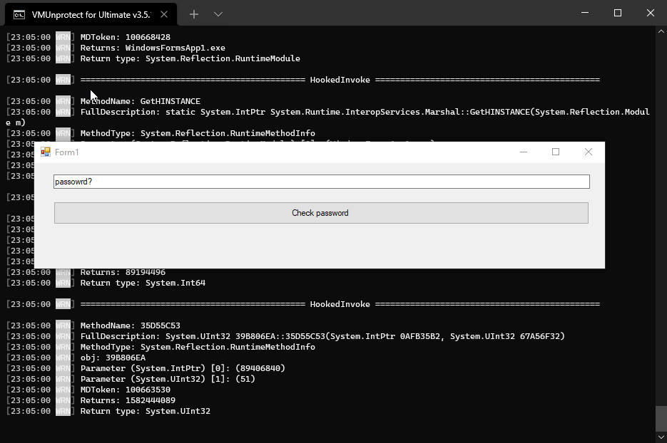

<p align="center">
  
<h1 align="center">VMUnprotect.NET</h1>
<p align="center">
  <strong>VMUnprotect</strong> is a project engaged in hunting virtualized <a href="https://vmpsoft.com">VMProtect</a> methods. It makes use of <a href="https://github.com/pardeike/Harmony">Harmony</a> to dynamically read <strong>VMP</strong> behavior. Currently only supports method administration. Works on <a href="https://vmpsoft.com/20210919/vmprotect-3-5-1/">VMProtect 3.5.1</a> (Lasted) and few versions back.
</p>
</p>
<p align="center">
  
  
</p>
</p>

## Showcase


## Usage
```sh
VMUnprotect.exe <path to assembly> [args to assembly]
```

# Supported Protections
Note: ***All Supported Protections are working combined***

Protection Name | Is supported | 
------------- | :----: 
Memory Protection | Yes 
Import Protection | Yes 
Resource Protection | Yes 
Debugger Detection | Yes 
Virtualization Tools | Yes 
Strip Debug Information | Yes 
Pack the Output File | No

## Usage can be found in ```MiddleMan.cs```
```csharp
namespace VMUnprotect
{
    /// <summary>
    ///     Works as Middle Man to make life easier
    /// </summary>
    internal static class MiddleMan
    {
        /// <summary>
        ///     This function manipulate can manipulate, log actual invokes from virtualized VMP functions.
        /// </summary>
        public static void VmpMethodLogger(
            object obj,
            BindingFlags? bindingFlags,
            Binder binder,
            ref object[] parameters,
            CultureInfo culture,
            MethodBase methodBase,
            ref object returnValue)
        {
            ConsoleLogger.Warn("MethodName: {0}", methodBase.Name);
            ConsoleLogger.Warn("FullDescription: {0}", methodBase.FullDescription());
            ConsoleLogger.Warn("MethodType: {0}", methodBase.GetType());
            if (obj != null) ConsoleLogger.Warn("obj: {0}", obj.GetType());

            // Loop through parameters and log them
            for (var i = 0; i < parameters.Length; i++)
            {
                var parameter = parameters[i];
                ConsoleLogger.Warn("Parameter ({1}) [{0}]: ({2})", i, parameter.GetType(), parameter);
            }

            ConsoleLogger.Warn("MDToken: {0}", methodBase.MetadataToken);
            ConsoleLogger.Warn("Returns: {0}", returnValue);

            if (returnValue != null)
                ConsoleLogger.Warn("Return type: {0}\n", returnValue.GetType());
        }
    }
}
```

## Current Features
- Tracing invokes in virtualized methods.
- Manipulating parameters and return values.

# FAQ
### What is code virtualization? 
As VMProtect describes it on their's website. Code virtualization is the next step in software protection. Most protection systems encrypt the code and then decrypt it at the application’s startup. VMProtect doesn’t decrypt the code at all! Instead, the encrypted code runs on a virtual CPU that is markedly different from generic x86 and x64 CPUs as the command set is different for each protected file.

### Can it devirtualize VMP?
No, isn't even meant for devirtualization.

## Credits
This tool uses the following (open source) software:
* [dnlib](https://github.com/0xd4d/dnlib) by [0xd4d](https://github.com/0xd4d), licensed under the MIT license, for reading/writing assemblies.
* [Harmony](https://github.com/pardeike/Harmony) by [Andreas Pardeike](https://github.com/pardeike), licensed under the MIT license, for patching the stacktrace which allows for reflection invocation to be used.
* [Serilog](https://github.com/serilog/serilog) provides diagnostic logging to files, the console, and elsewhere. It is easy to set up, has a clean API.
