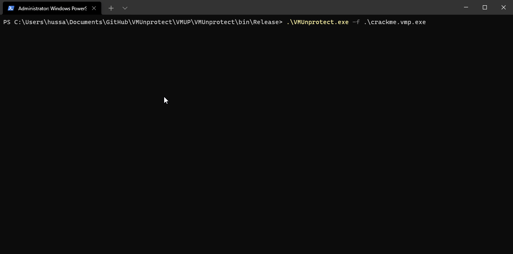

<p align="center">
  
<h1 align="center">VMUnprotect.NET</h1>
<p align="center">
  <strong>VMUnprotect</strong> is a project engaged in hunting virtualized <a href="https://vmpsoft.com">VMProtect</a> methods. It makes use of <a href="https://github.com/pardeike/Harmony">Harmony</a> to dynamically read <strong>VMP</strong> behavior. Currently only supports method administration. Works on <a href="https://vmpsoft.com/20210919/vmprotect-3-5-1/">VMProtect 3.5.1</a> (Latest) and few versions back.
</p>
</p>
<p align="center">
  
  
</p>
</p>

## Showcase


# Usage
```sh
VMUnprotect.exe 
  -f, --file             Required. Path to file.
  --enableharmonylogs    (Default: false) Disable or Enable logs from Harmony.
  --bypassantidebug      (Default: false) Bypass VMProtect Anti Debug.
  --help                 Display this help screen.
  --version              Display version information.
```

### Doesn't work? Make sure you dump the file before with:
* [VMUnprotect.Dumper](https://github.com/void-stack/VMUnprotect.Dumper)

# Supported Protections
Note: ***All Supported Protections are working combined***

Protection Name         | Is supported 
------------------------|-------------- 
Memory Protection       | ✓  
Import Protection       | ✓  
Resource Protection     | ✓  
Debugger Detection      | ✓  
Virtualization Tools    | ✓ 
Strip Debug Information | ✓  
Pack the Output File    | ✓ 

## Current Features
- Tracing invokes in virtualized methods.
- Manipulating parameters and return values.
- Bypass NtQueryInformationProcess, IsLogging, get_IsAttached

## Usage can be found in VMUnprotect.Runtime.MiddleMan
```csharp
/// <summary>
/// A prefix is a method that is executed before the original method
/// </summary>
public bool Prefix(ref object __result, ref object __instance, ref object obj, ref object[] parameters, ref object[] arguments) {
    var virtualizedMethodName = new StackTrace().GetFrame(7).GetMethod();
    var method = (MethodBase) __instance;
    Logger.Print("VMP MethodName: {0} (MDToken 0x{1:X4})", virtualizedMethodName.FullDescription(),
                 virtualizedMethodName.MetadataToken.ToString());
    Logger.Print("MethodName: {0}", method.Name);
    Logger.Print("FullDescription: {0}", method.FullDescription());
    Logger.Print("MethodType: {0}", method.GetType());
    // ReSharper disable once ConditionIsAlwaysTrueOrFalse
    if (obj is not null)
        Logger.Print("Obj: {0}", Formatter.FormatObject(obj));
    // Loop through parameters and log them
    for (var i = 0; i < parameters.Length; i++) {
        var parameter = parameters[i];
        Logger.Print("Parameter ({1}) [{0}]: ({2})", i, parameter.GetType(), Formatter.FormatObject(parameter));
    }
    var returnType = method is MethodInfo info ? info.ReturnType.FullName : "System.Object";
    Logger.Print("MDToken: 0x{0:X4}", method.MetadataToken);
    Logger.Print("Return Type: {0}", returnType ?? "null");
    return true;
}

/// <summary>
///  A postfix is a method that is executed after the original method
/// </summary>
public void Postfix(ref object __instance, ref object __result, ref object obj, ref object[] parameters, ref object[] arguments) {
    Logger.Print("Returns: {0}", __result);
}
```

# FAQ
### What is code virtualization? 
As VMProtect describes it on their's website. Code virtualization is the next step in software protection. Most protection systems encrypt the code and then decrypt it at the application’s startup. VMProtect doesn’t decrypt the code at all! Instead, the encrypted code runs on a virtual CPU that is markedly different from generic x86 and x64 CPUs as the command set is different for each protected file.

### Can it devirtualize VMP?
No, isn't even meant for devirtualization.

Todo                             | Done
---------------------------------|---------
Change this to support more VM's | X
VMP Stack tracing                | X 
Bypass VMP Debugger Detection    | ✓  
Bypass VMP CRC Check             | X  
WPF GUI                          | X 


# Credits, checkout my blog about [VMUnprotect](https://void-stack.github.io)
* [Washi](https://github.com/Washi1337) Overall credits for the project and inspiration with UnsafeInvokeInternal, thanks <3

This tool uses the following (open source) software:
* [dnlib](https://github.com/0xd4d/dnlib) by [0xd4d](https://github.com/0xd4d), licensed under the MIT license, for reading/writing assemblies.
* [Harmony](https://github.com/pardeike/Harmony) by [Andreas Pardeike](https://github.com/pardeike), licensed under the MIT license
* [Serilog](https://github.com/serilog/serilog) provides diagnostic logging to files, the console, and elsewhere. It is easy to set up, has a clean API.
* [commandline](https://github.com/commandlineparser/commandline) offers CLR applications a clean and concise API for manipulating command line arguments and related tasks
* [Autofac](https://github.com/autofac/Autofac) Autofac is an IoC container for Microsoft .NET. It manages the dependencies between classes so that applications stay easy to change as they grow in size and complexity. This is achieved by treating regular .NET classes as components.

## 💵 Want to buy me a Coffee?
     - Donate BTC at `bc1q048wrqztka5x2syt9mtj68uuf73vqry60s38vf`
     - Donate ETH at `0x86b2C17C94A1E6f35d498d17a37dc1f8A715139b`
